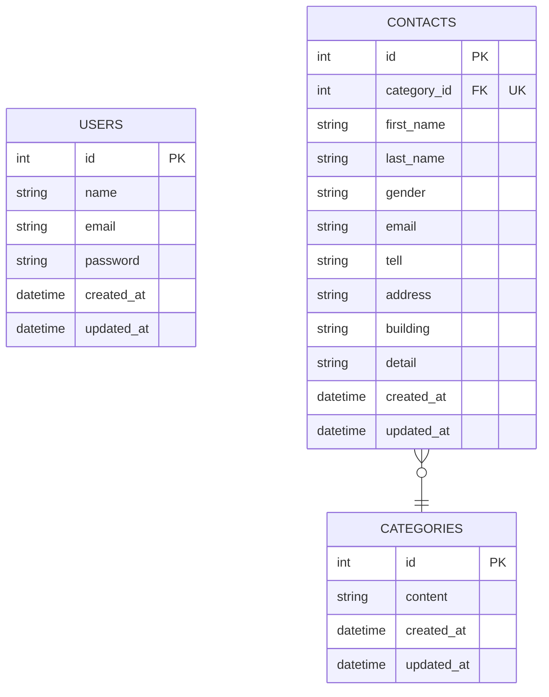

# README

This README would normally document whatever steps are necessary to get the
application up and running.

Things you may want to cover:

* Ruby version

* System dependencies

* Configuration

* Database creation

* Database initialization

* How to run the test suite

* Services (job queues, cache servers, search engines, etc.)

* Deployment instructions

* ...

## 環境構築
1
docker-compose run app rails new . --force --database=mysql

2
asdf install

3
bundle install

4
docker-compose run app rails db:create

# アプリケーション名

**FashionablyLate**

## 環境構築

**Docker構築**

リポジトリをclone

```jsx
git clone git@github.com:tanakahikari-pikka/contact-form-laravel.git
```

railsアプリの作成

```ruby
docker-compose run app rails new . --force --database=mysql
```

**Rails構築**

依存Gemのインストール

```jsx
 gem install mysql2 -v 0.5.6 -- --with-ldflags=-L$(brew --prefix zstd)/lib
 bundle install
```

環境変数の追加

- .envファイルをsrcディレクトリ直下に作成
- 「.env.example」の内容を.envファイルにコピー

マイグレーション

```jsx
docker-compose exec app php artisan migrate
```

シード作成

```jsx
docker-compose exec app php artisan db:seed
```

## 使用技術(実行環境)

- PHP: 8.0.2
- Laravel: 9.19
- MySQL8.0.32

## ER図



## URL

開発環境：http://localhost:8080/
phpMyAdmin: http://localhost:8081/
